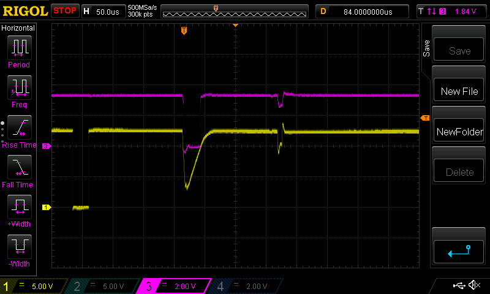
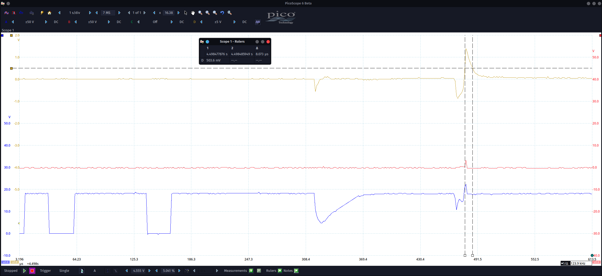
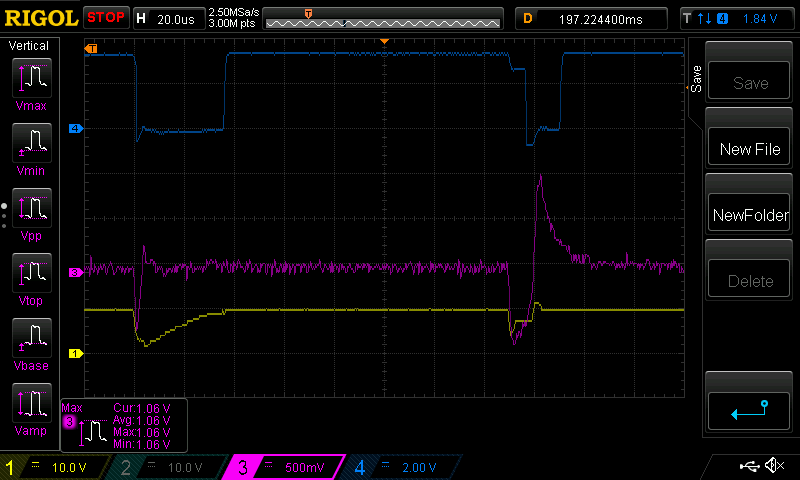
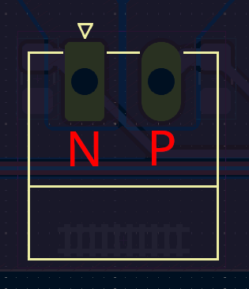

# DRV8328Shield

<a href="https://openremise.at">
<picture>
  <source media="(prefers-color-scheme: dark)" srcset="https://github.com/OpenRemise/.github/raw/master/data/icons/icon_dark.svg">
  
</picture>
</a>

The DRV8328Shield was a prototype of a shield with [DRV8328](https://www.ti.com/product/DRV8328) in [Arduino](https://www.arduino.cc/) form factor. Due to the inadequacies of the stackable headers, Arduino compatibility was abandoned and single-board solutions are now used.

### Revision A errors
- PVDD should be tied to VIN instead of 5V  
  5V is simply too low to keep the high side switched on continuously

- TPS27S100B doesn't turn off if two consecutive shorts are too close together (see [this](https://e2e.ti.com/support/power-management-group/power-management/f/power-management-forum/1402669/tps27s100-two-consecutive-shorts-second-one-not-recognized) post on the TI forum)  
  This is an issue for the ACK detection. The second ACK would simply get lost in this case.  
    

  The only reliable fix for this might be to monitor IMON as well. Here is a capture of the second ACK pulse of an MX645 during a DECUP update. IMON is above 500mV for about 8µs.
    

  As it later turned out this isn't a workaround either.  
  | While some shorts look like this                                                              | Others look like this                                                                       |
  | --------------------------------------------------------------------------------------------- | ------------------------------------------------------------------------------------------- |
  |  |  |

  And that 420mV pulse is too short for a common LM339... now what?

- TPS27S100B could use another 1µF ceramic capacitor at IN (e.g. same as at OUT)

- N and P tracks are reversed  
  We currently generate the signal for INHA (output SHA) with the first half-bit 1 and the second half-bit 0. It must stay that way because we want the RMT end-of-transmission level to be 0. The problem is that a signal with the first half-bit 1 would mark the P and not the N track. Currently we feed SHA into the N pin though.  
    